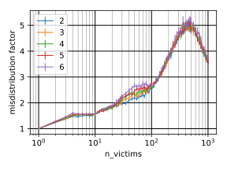

author:
    name: Eklavya Sharma
    email: ekurgn@gmail.com
title: BoR against DDoS
output: index.html

---

# DDoS Protection

## Eklavya Sharma, BITS Pilani, ekurgn@gmail.com

---

### My paper

Mitigating DNS Amplification Attacks using a set of Geographically-Distributed SDN Routers.

* Eklavya Sharma, BITS Pilani, ekurgn@gmail.com
* Vishal Gupta, BITS Pilani, vishalgupta@pilani.bits-pilani.ac.in

---

### Outline

* Motivation
* Proposed method
* Experimental results
* Summary
* Future work

---

# Motivation

---

### Network DoS attacks

* Denial of Service (DoS) attack.
* Network DoS attack [Mirkovic and Reiher].
* Github received a 1.35 Tb/s attack on 2018-02-28.

---

### DNS amplification attack

* Attacker sends DNS request flood to DNS servers.
  Source address of packet = Victim's address.
* DNS servers send response flood to victim.
* Since response size >> request size, amplification!

---

### Current results

* Filtering by victim only happens in victim's network.
* This is unsuitable for huge attacks.

---

# Proposed Method

---

### Basic idea of solution

* Spread many routers (called barrier) across internet.
* Route all incoming and outgoing traffic through barrier.
* Victim has 2 addresses: Secret and Public.
* Routers will filter out attack traffic and forward rest to victim.

---

### Details

* How to ensure that barrier itself isn't DDoSed?
* How exactly does forwarding happen?
* How does filtering happen?

---

### Anycasting

* Definition: Multiple hosts sharing the same IP address.
* Catchment area.

---

### Anycast barrier

* Public address is advertised from each barrier router.
* Strategically placing routers.
* Filter attack traffic
* Wrap and forward the rest to victim.

---

### Incoming

---

### Outgoing

---

### DAAD

* By Kambourakis, Moschos, Geneiatakis, Gritzalis.
* Keep track of outgoing DNS requests and match DNS responses with them.

---

### Anycast Barrier Filtering

* Different barrier routers for request and response.
* DNS requests will be broadcast.
* Responses will probably reach after requests.

---

### ISFRADR

* Use SDN routers instead of original DAAD.
* Installing SDN Flow Rules for Anticipated DNS Responses.

---

# Experiments and results

---

### Catchment area sizes

* Make a small model of internet.
* Place anycast barriers intelligently.
* Calculate catchment areas.
* `n` = Number of barrier routers.
* `r` = Max relative catchment area.

---

* `m` = Misdistribution factor = `r * n`.
* Plot `m` and `r` as functions of `n` for different hyperparameters
  of the internet model.

---

Hyperparameter: Average node degree

---

### Observations

* `m` and `r` aren't affected much by choice of hyperparameters.
* `m` is low. This means attack can be well-divided.

---

### Summary

* DNS Amplification attacks.
* Current literature doesn't consider huge attacks.
* How Anycast Barrier works.
* Traffic can be divided almost equally across routers.

---

### Future work

* Implement and benchmark ISFRADR.
* Try out Anycast barrier in real life.
  In simulation we don't know attack distribution.
* Extend to non-reflection attacks.
* Better router placement algorithm.

---

# Questions
